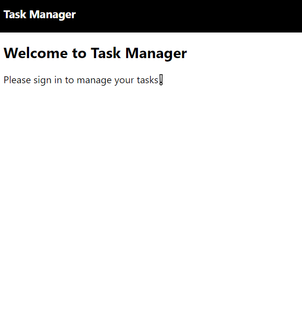

Task Manager

Task Manager is a responsive web application built with React, TailwindCSS, Firebase, and React-Toastify. It allows users to manage their tasks, including adding, updating, and deleting tasks. Each user can only see their own tasks after signing in.

## Features

- *Responsive Design*: Implemented with TailwindCSS, ensuring a seamless experience across different devices.
- *Firebase Authentication*: Secure user management with Firebase Auth.
- *Firestore Integration*: Persistent task storage for each user.
- *Task Management*: Users can add, update, and delete their tasks.
- *Notifications*: User feedback provided via React-Toastify.

## Screenshots


## Live Demo
## Screenshots


## Sign In page


## Sign Up Page


## Home Page

#


Check out the live demo [here](link_to_live_demo).

## Getting Started

Follow these instructions to set up and run the project on your local machine.

### Prerequisites

- Node.js and npm installed
- Firebase project set up

### Installation

1. *Clone the repository*:
   ```sh
   git clone https://github.com/yourusername/task-manager.git
   cd task-managerTask Manager

Task Manager is a responsive web application built with React, TailwindCSS, Firebase, and React-Toastify. It allows users to manage their tasks, including adding, updating, and deleting tasks. Each user can only see their own tasks after signing in.

## Features

- *Responsive Design*: Implemented with TailwindCSS, ensuring a seamless experience across different devices.
- *Firebase Authentication*: Secure user management with Firebase Auth.
- *Firestore Integration*: Persistent task storage for each user.
- *Task Management*: Users can add, update, and delete their tasks.
- *Notifications*: User feedback provided via React-Toastify.

## Screenshots


## Live Demo

Check out the live demo [here](link_to_live_demo).

## Getting Started

Follow these instructions to set up and run the project on your local machine.

### Prerequisites

- Node.js and npm installed
- Firebase project set up

### Installation

1. *Clone the repository*:
   ```sh
   git clone https://github.com/yourusername/task-manager.git
   cd task-manager